# bitsperity-libs

## AI-Entwicklungspipeline für TypeScript Libraries

Diese Pipeline automatisiert die Entwicklung von lightweight, state-of-the-art TypeScript Libraries durch eine Kette spezialisierter AI-Agenten.

## Pipeline-Überblick

```mermaid
graph TD
    A[Projekt Start] --> B[lib-crafter Agent]
    
    subgraph "1. High-Level Planning (lib-crafter)"
        B1[lib-interviewer.mdc] --> B2[lib-researcher.mdc]
        B2 --> B3[lib-doc-creator.mdc]
        B --> B1
        B3 --> C[Output: High-Level Docs]
    end
    
    C --> D[requirements-agent]
    
    subgraph "2. Requirements Analysis (requirements-agent)"
        D1[requirements-analyzer.mdc] --> D2[requirements-interviewer.mdc]
        D2 --> D3[requirements-doc-creator.mdc]
        D --> D1
        D3 --> E[Output: Requirements Docs]
    end
    
    E --> F[systemdesign-agent]
    
    subgraph "3. System Design (systemdesign-agent)"
        F1[systemdesign-analyzer.mdc] --> F2[systemdesign-interviewer.mdc]
        F2 --> F3[systemdesign-researcher.mdc]
        F3 --> F4[systemdesign-doc-creator.mdc]
        F --> F1
        F4 --> G[Output: System Design Docs]
    end
    
    G --> H[phaseplanner-agent]
    
    subgraph "4. Phase Planning (phaseplanner-agent)"
        H1[phaseplanner-analyzer.mdc] --> H2[phaseplanner-doc-creator.mdc]
        H --> H1
        H2 --> I[Output: Phase Plan]
    end
    
    I --> J[softwaredev-agent]
    
    subgraph "5. Implementation (softwaredev-agent)"
        J1[analyze_phase.mdc] --> J2[implement_phase.mdc]
        J2 --> J3[test_phase.mdc]
        J3 --> J4[finalize_phase.mdc]
        J4 --> J5{Weitere Phase?}
        J5 -->|Ja| J1
        J5 -->|Nein| K[Projekt Fertig]
        J --> J1
    end
    
    K --> L[Git Commit mit<br/>standardisiertem Header]
    
    style A fill:#e1f5fe
    style C fill:#f3e5f5
    style E fill:#e8f5e8
    style G fill:#fff3e0
    style I fill:#fce4ec
    style K fill:#e0f2f1
    style L fill:#f1f8e9
```



## Agent-Funktionen

### 1. lib-crafter Agent
**Zweck**: Definiert die Seele der Library - komplett abstecken was die Library können soll

**Rules Flow**:
- `lib-interviewer.mdc`: Führt dopamin-optimierte Gespräche über Library-Vision
- `lib-researcher.mdc`: Recherchiert verwandte Libraries und Best Practices
- `lib-doc-creator.mdc`: Erstellt umfassende High-Level Dokumentation

**Output**: High-Level Docs (api.md, lib-overview.md, user-stories.md, etc.)

### 2. requirements-agent
**Zweck**: Selektiert und detailliert nächstes Arbeitspaket aus Milestones

**Rules Flow**:
- `requirements-analyzer.mdc`: Analysiert High-Level Docs und wählt Milestone
- `requirements-interviewer.mdc`: Dopamin-optimiertes Interview zu Developer-Bedürfnissen  
- `requirements-doc-creator.mdc`: Erstellt detaillierte Requirements-Dokumentation

**Output**: Requirements Docs (features.md, acceptance-criteria.md, etc.)

### 3. systemdesign-agent
**Zweck**: Wandelt Requirements in klaren Software-Implementierungsplan um

**Rules Flow**:
- `systemdesign-analyzer.mdc`: Analysiert Requirements und High-Level Kontext
- `systemdesign-interviewer.mdc`: Klärt Design-Entscheidungen mit Nutzer
- `systemdesign-researcher.mdc`: Recherchiert technische Lösungen und Best Practices
- `systemdesign-doc-creator.mdc`: Erstellt System Design Dokumentation

**Output**: System Design Docs (architecture.md, api-contracts.md, technology-stack.md, etc.)

### 4. phaseplanner-agent
**Zweck**: Zerlegt System Design in testbare Entwicklungsphasen

**Rules Flow**:
- `phaseplanner-analyzer.mdc`: Analysiert System Design für Phasen-Zerlegung
- `phaseplanner-doc-creator.mdc`: Erstellt detaillierten Phasenplan

**Output**: Phase Planning Docs (phase-definitions.md, implementation-guide.md, etc.)

### 5. softwaredev-agent
**Zweck**: Iterative Implementierung und Testing aller Phasen

**Rules Flow** (Pro Phase):
- `analyze_phase.mdc`: Analysiert aktuelle Phase-Anforderungen
- `implement_phase.mdc`: Implementiert Phase-Code
- `test_phase.mdc`: Testet implementierte Funktionalität
- `finalize_phase.mdc`: Schließt Phase ab, erstellt Retrospektive

**Output**: Funktionierende Library + Test Suite + Deployment Setup

## Kommunikation zwischen Agenten

### Inter-Agent Communication (IAC)
- Dokumente die **innerhalb** eines Agents zwischen Rules fließen
- Beispiel: `interview-results.md` → `analysis-summary.md` innerhalb systemdesign-agent

### Output-Dokumente
- Dokumente die **zwischen** Agents fließen
- Beispiel: `lib-overview.md` (lib-crafter) → `features.md` (requirements-agent)

## Technische Prinzipien

### Lightweight Development
- Kein Enterprise-Bloat
- Minimal Dependencies
- State-of-the-Art Patterns
- Effizienter, sicherer Code

### Container-First Testing
- Jede Library hat Dockerfile + docker-compose.yml
- Alle Tests laufen im Container
- Klare Validierung von Phasen und Sessions

### Automatisierte Qualitätskontrolle
- Agents treffen technische Entscheidungen selbstständig
- Internet-Recherche für Best Practices
- Nutzer fokussiert sich nur auf DX und Problemstellung

## Git-Workflow

Jeder Agent commitet am Ende mit standardisiertem Header:
```
feat(agent-name/session-id): Professional commit message

- Phase/Session details
- Key achievements
- Next steps
```

## Verzeichnisstruktur

```
bitsperity-libs/                 # Root-Repo mit AI-Pipeline
├── .cursor/
│   └── rules/                   # Cursor Rules für alle Agents
├── ai_docs/                     # Pipeline-Dokumentation
│   └── {lib-name}/
│       ├── high_level/          # lib-crafter output
│       └── low_level/
│           └── session-{id}/
│               ├── req/         # requirements-agent output
│               ├── design/      # systemdesign-agent output
│               ├── plan/        # phaseplanner-agent output
│               └── dev/         # softwaredev-agent output
├── README.md                    # Pipeline-Dokumentation
├── {lib-name-1}/                # Library 1
│   ├── src/                     # Library source code
│   ├── tests/                   # Test suites
│   ├── Dockerfile               # Container setup
│   ├── docker-compose.yml      # Development environment
│   └── README.md               # Library documentation
├── {lib-name-2}/                # Library 2
│   ├── src/
│   ├── tests/
│   ├── Dockerfile
│   ├── docker-compose.yml
│   └── README.md
└── ...                          # Weitere Libraries
```

## Entwicklungsphilosophie

**"Chat What You Get"** - Wir diskutieren nur über finale Deliverables:
- Developer Experience (DX)
- Problemstellung & Lösung
- API-Design & Nutzung

**Reine Effizienz** - Alle technischen Entscheidungen werden von Agents getroffen:
- Technologie-Stack
- Architektur-Patterns  
- Deployment-Strategien
- Testing-Frameworks

**Open Source Excellence** - Entwicklung hochwertiger, wiederverwendbarer TypeScript Libraries ohne Kompromisse.