# bitsperity-libs

## 🚀 AI-Accelerated TypeScript Library Development

**Production-ready libraries in days, not weeks** - AI-first pipeline combining 22 sophisticated Cursor agents with Claude Code orchestration.

⚡ **Quick Start**: `/vision-create my-library` → development pipeline → production deployment

🎯 **Proven Results**: `nostr-unchained` library built with this pipeline - complete NIP-17 implementation with 40+ tests

## 📋 How to Use This Pipeline

### Prerequisites
```bash
# Required tools
npm install -g claude          # Claude Code CLI
gh auth login                  # GitHub CLI (for repositories)
docker --version               # Container support
```

### 🎯 Create a New Library (Complete Workflow)

#### 1. Strategic Vision (5-10 minutes)
```bash
/vision-create my-awesome-library
```
**What happens**: AI interviews you about your library vision, researches similar libraries, creates strategic roadmap.  
**Output**: `ai_docs/my-awesome-library/high_level/` with complete vision docs.

#### 2. Development Pipeline (Iterative, per milestone)
```bash
# Initialize first milestone
/orchestrate start milestone-1

# Execute development chain
/orchestrate requirements   # ⏱️ 5-10 min: AI analyzes requirements 
/orchestrate architecture   # ⏱️ 10-15 min: AI designs system architecture
/orchestrate planning       # ⏱️ 5 min: AI creates implementation roadmap
/orchestrate implementation # ⏱️ 30-120 min: AI-accelerated TDD development
/orchestrate validation     # ⏱️ 5 min: Quality gate validation
```

#### 3. Results
✅ **Production-ready TypeScript library** with 90%+ test coverage  
✅ **Complete documentation** with examples and API docs  
✅ **Docker containerization** for consistent environments  
✅ **GitHub integration** ready for open source release

### 🔄 Development Workflow Summary

```mermaid
graph LR
    A[💡 Vision] --> B[📋 Requirements] 
    B --> C[🏗️ Architecture]
    C --> D[📅 Planning] 
    D --> E[⚡ Implementation]
    E --> F[✅ Validation]
    
    F --> G{Next Milestone?}
    G -->|Yes| B
    G -->|No| H[🚀 Release]
```



**Total Time**: 1-3 hours per milestone → Production-ready library in days

### 🎛️ Advanced Usage

#### Individual Agent Execution
```bash
# Run specific sophisticated agents
/agent-sophisticated requirements   # Deep requirements analysis
/agent-sophisticated systemdesign   # Architecture planning with research
/agent-sophisticated phaseplanner   # Phase decomposition
/agent-sophisticated softwaredev    # AI-accelerated development

# Phase-specific analysis
/requirements-analyze milestone-2   # Analyze specific milestone
/test-validate integration-tests   # Validate test suites
```

#### Pipeline Monitoring
```bash
/orchestrate status    # Check current pipeline state
/gates status         # Phase gate validation status  
```

#### Troubleshooting
```bash
/orchestrate reset    # Reset pipeline to last valid gate
```

## 🏗️ Pipeline Architecture

### 5-Agent Development Chain

**1. 💡 lib-crafter** → Strategic vision & library scope  
**2. 📋 requirements-agent** → Milestone analysis & requirements  
**3. 🏗️ systemdesign-agent** → Architecture & technical design  
**4. 📅 phaseplanner-agent** → Implementation roadmap  
**5. ⚡ softwaredev-agent** → TDD development & testing

### Hybrid Intelligence System

**🧠 Cursor Agents (22 sophisticated rules)**
- Enterprise-level complexity handling
- Domain-specific analysis (crypto, ML, protocols)  
- Dopamine-optimized interviews
- Comprehensive research capabilities

**🚀 Claude Code Orchestration**
- Native tooling integration
- Test-driven development workflows
- Phase gate validation
- Container-first environments

### Communication Architecture
```
Rule-to-Rule (IAC/) ──→ Agent-to-Agent ──→ Next Phase
     ↑                        ↓
Internal logic         Milestone outputs
```

**IAC Structure**: Sophisticated inter-rule communication  
**Agent Outputs**: Clean handoffs between development phases

## 🎯 What Makes This Special

### ⚡ Speed & Quality
- **Production libraries in days** instead of weeks/months
- **90%+ test coverage** automatically generated
- **Enterprise-grade architecture** decisions made by AI
- **Zero technical debt** through continuous validation

### 🧠 Intelligence & Sophistication  
- **22 specialized AI agents** for different development phases
- **Domain expertise** in crypto, ML, protocols, APIs
- **Dopamine-optimized** developer experience
- **Research-backed** technology decisions

### 🔧 Developer Experience
- **Focus on WHAT, not HOW** - describe your vision, AI handles implementation
- **Test-driven by default** - Vitest 3.2+ with comprehensive validation
- **Container-first** - consistent environments across all platforms
- **GitHub-ready** - automated documentation, CI/CD, release preparation

### 📊 Real Results

**nostr-unchained library** (built with this pipeline):
- ✅ Complete NIP-17 private message implementation
- ✅ 40+ comprehensive tests with live relay integration  
- ✅ Production-ready crypto (NIP-44/NIP-59)
- ✅ Full TypeScript with sophisticated type system
- ✅ 4 major milestones completed in record time

## 🚢 Production Deployment

Every library includes:
```bash
# Production-ready setup
npm run build         # Optimized TypeScript compilation
npm run test          # Comprehensive test suite  
npm run lint          # Code quality validation
docker-compose up     # Container deployment
npm publish           # NPM package publishing
```

## 📁 Project Structure

```
bitsperity-libs/                 # 🏠 AI-Accelerated Development Environment
├── 🤖 .cursor/rules/            # 22 sophisticated AI agents
├── ⚡ .claude/commands/          # Claude Code orchestration
├── 📊 ai_docs/{lib-name}/       # AI communication & documentation
│   ├── high_level/              # Strategic vision (lib-crafter)
│   └── low_level/session-X/     # Milestone development
├── 📚 {your-library}/           # Production-ready library
│   ├── src/                     # TypeScript source
│   ├── tests/                   # Comprehensive test suite
│   ├── 🐳 Dockerfile            # Container deployment
│   └── 📖 docs/                 # Auto-generated documentation
└── 📋 CLAUDE.md                 # Detailed pipeline documentation
```

## 🚀 Getting Started

### 1. **Clone & Setup**
```bash
git clone https://github.com/your-username/bitsperity-libs
cd bitsperity-libs

# Install dependencies (if missing)
npm install -g claude gh
gh auth login
```

### 2. **Create Your First Library** 
```bash
/vision-create my-awesome-library
# ⏱️ 5-10 minutes of AI-guided vision interview
```

### 3. **Develop Your First Milestone**
```bash
/orchestrate start milestone-1
/orchestrate requirements    # ⏱️ 5-10 min
/orchestrate architecture    # ⏱️ 10-15 min  
/orchestrate planning        # ⏱️ 5 min
/orchestrate implementation  # ⏱️ 30-120 min
/orchestrate validation      # ⏱️ 5 min
```

### 4. **Ship to Production** 🚢
```bash
cd my-awesome-library/
npm run build && npm test && npm publish
```

**That's it!** Production-ready TypeScript library with enterprise-grade quality.

---

## 📖 Documentation

- **[CLAUDE.md](./CLAUDE.md)** - Detailed pipeline documentation and advanced workflows
- **[AI Docs](./ai_docs/)** - AI-generated documentation for each library
- **Library READMEs** - Individual library documentation and examples

## 🎯 Philosophy

**"Chat What You Get"** - Focus on your vision, AI handles the technical complexity  
**"Enterprise Quality, Solo Speed"** - Professional-grade libraries without the overhead  
**"Test-Driven by Design"** - Every feature validated before implementation

---

*Built with ❤️ using Claude Code + Cursor IDE hybrid intelligence*