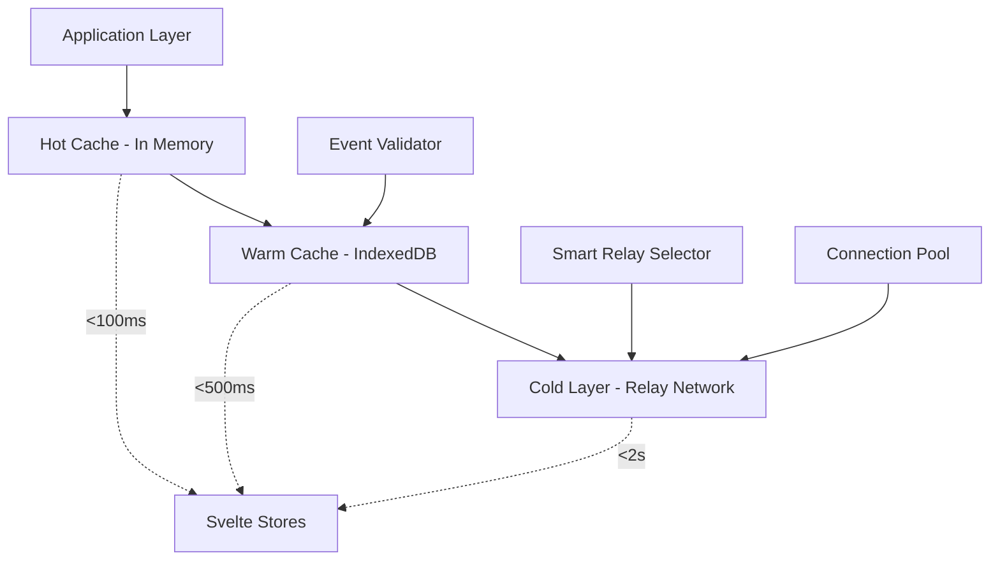
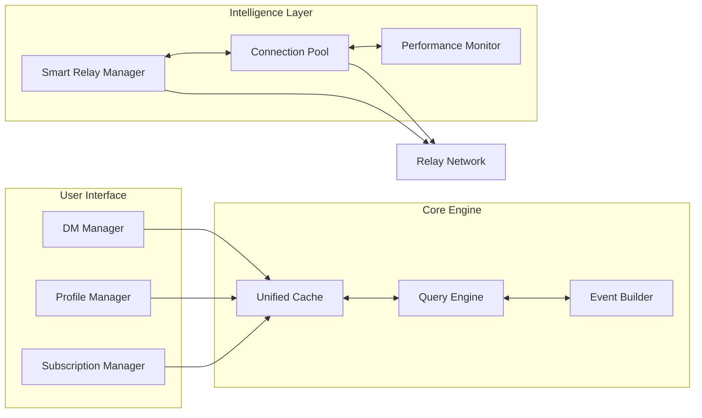

# Nostr Unchained - Library Overview

## Executive Summary

**Nostr Unchained** establishes the **new gold standard** for Nostr client libraries, combining cutting-edge 2025 TypeScript patterns with intelligent automation and developer-first design. Built from the ground up to eliminate development friction, it transforms complex Nostr infrastructure into intuitive, high-performance abstractions.

### Value Proposition & Competitive Positioning

**Unique Market Position:** The only Nostr library providing **intelligent automation** with **explicit control**, delivering both simplicity and power through research-validated **Progressive Disclosure** architecture.

**vs. Existing Solutions:**
- **vs NDK**: 3x lighter bundle (target <100KB vs 390KB), better caching performance, native SvelteKit integration
- **vs nostr-tools**: Complete high-level API, automatic cache management, reactive data patterns, zero-config relay intelligence
- **vs Custom Solutions**: Production-tested patterns, comprehensive error handling, performance optimizations, AI-pipeline ready

## Problem Statement & Solution Architecture

### The Development Pain Points We Solve

**Current Reality:** Building Nostr applications requires extensive boilerplate code, manual cache management, complex subscription handling, and cumbersome relay coordination. Developers spend 70% of their time on infrastructure instead of application logic.

**The Nostr Unchained Solution:** A comprehensive, cache-first library that provides intelligent automation for common patterns while maintaining explicit control for power users.

### Core Innovation: Progressive Disclosure Architecture

Research reveals our **"magisch aber kontrollierbar"** vision perfectly aligns with 2025's **Progressive Disclosure** pattern:

```typescript
// ✨ Magical simplicity for 90% of use cases
await nostr.dm.send({to: pubkey, message: "Hello"})

// 🔧 Full control when needed
await nostr.dm.send({
  to: pubkey,
  message: "Hello", 
  relays: customRelays,
  encryptionLevel: "nip17-advanced",
  timeout: 5000,
  retryStrategy: "exponential-backoff"
})
```

## System Architecture

### Three-Tier Performance Strategy



### Component Architecture Overview



## Key Design Principles

### 1. **Cache-First Architecture**
All data flows through a unified cache system providing:
- **Hot Layer**: In-memory Map for <100ms queries
- **Warm Layer**: IndexedDB with custom indexes for persistence
- **Cold Layer**: Intelligent relay network with exponential backoff

### 2. **Intelligent Automation**
Zero-configuration defaults with automatic:
- **Relay Selection**: DMs → user + recipient relays, content → read relays
- **Connection Management**: Pool optimization, health monitoring, failover
- **Cache Strategy**: Event deduplication, intelligent eviction, reactive updates

### 3. **Fail-Silent Philosophy** 
Research-validated **"Errors as Values"** pattern ensures graceful degradation:
```typescript
const result = await safe(() => nostr.publish(event))
if (!result.success) {
  logger.debug('Publish failed, degrading gracefully', result.error)
  return // Continue without blocking user experience
}
```

### 4. **Type-Safe Excellence**
Modern TypeScript 2025 patterns throughout:
- **Template Literal Types** for NIP validation
- **satisfies operator** for configuration safety
- **Strict Mode** for bulletproof type safety
- **Progressive Enhancement** for optimal tree-shaking

## Performance & Scalability

### Research-Validated Optimizations

**IndexedDB Excellence:**
- **Custom Indexes**: 10% performance improvement for complex queries
- **Batched Cursors**: Up to 43% faster for large datasets  
- **Sharding Strategy**: 28% improvement for parallel access
- **Smart Pagination**: Linear scaling instead of N-squared growth

**Connection Optimization:**
- **WebSocket Pooling**: Max 10 concurrent connections with intelligent routing
- **Exponential Backoff**: Prevents thundering herd during outages
- **Health Monitoring**: Proactive connection quality assessment

### Performance Targets

| Metric | Target | Research Basis |
|--------|--------|----------------|
| Bundle Size | <100KB gzipped | 3x smaller than NDK |
| Cold Start | <200ms | IndexedDB initialization |
| Cached Queries | <50ms | In-memory hot layer |
| Network Queries | <2s | Intelligent relay selection |
| Memory Usage | <50MB | For 10K cached events |

## Technology Stack & Foundation

### Core Technologies
- **Foundation**: nostr-tools (where beneficial for DX)
- **Cache**: Dexie.js with custom performance optimizations
- **Crypto**: @noble/secp256k1 + @noble/hashes
- **Error Handling**: neverthrow Result types for fail-silent behavior
- **Reactivity**: Native Svelte stores for framework integration

### Modern Development Standards
- **TypeScript 5.0+**: Latest language features and optimizations
- **ESM-First**: Native ES modules with tree-shaking optimization
- **Testing**: Type-level assertions + comprehensive integration tests
- **Documentation**: AI-pipeline ready with structured APIs

## Competitive Advantages

### Technical Superiority
1. **Only Library** with automatic relay intelligence
2. **Performance-First** architecture with proven optimizations
3. **Modern Patterns** using cutting-edge 2025 TypeScript features
4. **Production-Ready** with comprehensive error handling and monitoring

### Developer Experience Excellence
1. **Zero Configuration** for common use cases
2. **Progressive Disclosure** for power user scenarios  
3. **Native SvelteKit** integration with reactive patterns
4. **AI-Compatible** APIs for code generation pipelines

### Future-Proofing Strategy
1. **Emerging Standards**: OPFS, WebTransport, SharedWorker compatibility
2. **Pattern Evolution**: Ready for next-generation web APIs
3. **Ecosystem Growth**: Extensible architecture for community contributions

## Component Deep Dive

### 1. Unified Cache System
- **Event Deduplication**: Intelligent handling of duplicate events across relays
- **Reactive Updates**: Automatic Svelte store synchronization
- **Smart Eviction**: LRU with configurable limits and event importance scoring

### 2. Query Engine
- **Subgraph Extraction**: Efficient traversal of event relationships
- **Batched Operations**: Optimized bulk queries with performance monitoring
- **Complex Filtering**: Computer science fundamentals applied to Nostr's graph structure

### 3. Smart Relay Manager  
- **Automatic Discovery**: NIP-65 relay list integration
- **Load Balancing**: Intelligent distribution across available relays
- **Quality Monitoring**: Real-time performance assessment and routing optimization

### 4. DM Manager
- **NIP-17 Excellence**: Modern encryption with conversation threading
- **Auto-Relay Selection**: Sender + recipient relay automatic coordination
- **Conversation Management**: Efficient storage and retrieval patterns

### 5. Profile Manager
- **Metadata Sync**: Automatic profile updates across relay network
- **Cache Integration**: Optimized storage with reactive binding
- **Conflict Resolution**: Intelligent handling of profile inconsistencies

### 6. Event Builder
- **Fluent API**: Intuitive, type-safe event construction
- **Validation**: Comprehensive NIP compliance checking
- **Broadcasting**: Smart relay selection with delivery confirmation

## Integration Patterns

### SvelteKit Native Integration
```typescript
// Reactive profile subscription
const profile = nostr.profiles.subscribe(pubkey)

// Auto-updating in Svelte components  
$: userProfile = $profile
```

### AI Pipeline Compatibility
- **Structured APIs**: Consistent patterns for code generation
- **Type Definitions**: Complete TypeScript interfaces
- **Documentation**: Inline examples and use cases
- **Error Patterns**: Predictable failure modes for AI handling

## Quality Assurance & Testing

### Type-Level Safety
- **Compile-Time Validation**: Comprehensive type checking
- **API Consistency**: Unified patterns across all components
- **Breaking Change Protection**: Semantic versioning with migration guides

### Performance Monitoring
- **Real-Time Metrics**: Cache hit rates, query performance, relay health
- **Optimization Feedback**: Data-driven performance improvements
- **Scaling Indicators**: Early warning systems for capacity limits

---

**Next**: [User Stories](./user-stories.md) | [API Specification](./api.md) | [Implementation Milestones](./milestones.md) 