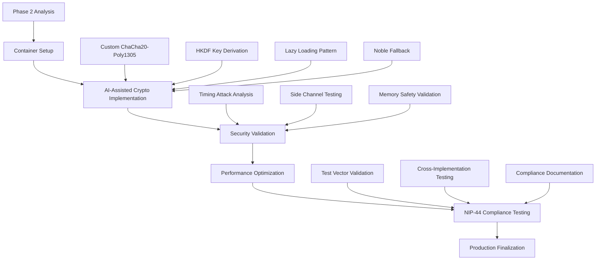

# Phase 2 Development Environment: Cryptographic Core

## Container-Based Cryptographic Development Stack

### Dockerfile.crypto-dev
```dockerfile
FROM node:18-alpine

# Install cryptographic development dependencies
RUN apk add --no-cache \
    python3 \
    make \
    g++ \
    libsodium-dev \
    openssl-dev \
    git

WORKDIR /app

# Install global crypto testing tools
RUN npm install -g crypto-test-vectors nist-test-vectors

# Copy package files
COPY package*.json ./
COPY .npmrc* ./

# Install dependencies mit crypto focus
RUN npm ci --include=dev

# Install additional crypto development tools
RUN npm install -D \
    @stablelib/chacha20poly1305 \
    @stablelib/hkdf \
    libsodium-wrappers \
    tweetnacl \
    @noble/ciphers \
    crypto-test-vectors

# Copy source code
COPY . .

# Create crypto-specific directories
RUN mkdir -p /app/src/crypto/test-vectors \
    /app/src/crypto/benchmarks \
    /app/src/crypto/audit

# Expose development ports
EXPOSE 3000 3001 9229

# Health check für crypto module
HEALTHCHECK --interval=30s --timeout=3s --start-period=5s --retries=3 \
  CMD node -e "console.log('Crypto dev environment healthy')" || exit 1

# Development command mit hot reload
CMD ["npm", "run", "dev:crypto"]
```

### Dockerfile.crypto-test  
```dockerfile
FROM node:18-alpine

# Security-focused testing environment
RUN apk add --no-cache \
    python3 \
    make \
    g++ \
    libsodium-dev \
    valgrind \
    strace

WORKDIR /app

# Copy package files
COPY package*.json ./
RUN npm ci --include=dev

# Install security testing tools
RUN npm install -D \
    @noble/ciphers \
    libsodium-wrappers \
    crypto-test-vectors \
    benchmark \
    clinic \
    autocannon

# Copy source code
COPY . .

# Run crypto compliance tests
CMD ["npm", "run", "test:crypto:compliance"]
```

### Dockerfile.security-audit
```dockerfile  
FROM node:18-alpine

# Security audit environment
RUN apk add --no-cache \
    python3 \
    openssl \
    gnupg \
    curl

WORKDIR /app

# Install security scanning tools
RUN npm install -g \
    retire \
    nsp \
    snyk \
    audit-ci

# Copy application
COPY package*.json ./
RUN npm ci --only=production

COPY . .

# Run comprehensive security audit
CMD ["npm", "run", "audit:comprehensive"]
```

### docker-compose.crypto.yml
```yaml
version: '3.8'

services:
  # Main development environment
  crypto-dev:
    build:
      context: .
      dockerfile: Dockerfile.crypto-dev
    ports:
      - "3000:3000"    # Main dev server
      - "9229:9229"    # Node.js debugging
    volumes:
      - .:/app
      - /app/node_modules
      - crypto-cache:/app/.crypto-cache
    environment:
      - NODE_ENV=development
      - CRYPTO_DEV_MODE=true
      - DEBUG=crypto:*
      - NODE_OPTIONS=--inspect=0.0.0.0:9229
    command: npm run dev:crypto
    healthcheck:
      test: ["CMD", "curl", "-f", "http://localhost:3000/health"]
      interval: 30s
      timeout: 10s
      retries: 3

  # Isolated crypto testing
  crypto-testing:
    build:
      context: .
      dockerfile: Dockerfile.crypto-test
    volumes:
      - .:/app
      - /app/node_modules
      - test-results:/app/test-results
    environment:
      - NODE_ENV=test
      - NIP44_COMPLIANCE_MODE=strict
      - CRYPTO_TEST_VERBOSE=true
    command: npm run test:crypto:watch
    depends_on:
      crypto-dev:
        condition: service_healthy

  # Security audit service
  security-audit:
    build:
      context: .
      dockerfile: Dockerfile.security-audit
    volumes:
      - .:/app
      - audit-reports:/app/audit-reports
    environment:
      - AUDIT_MODE=cryptographic
      - SECURITY_LEVEL=maximum
    command: npm run audit:crypto:full
    profiles: ["security"]

  # Performance benchmarking
  crypto-benchmark:
    build:
      context: .
      dockerfile: Dockerfile.crypto-test
    volumes:
      - .:/app
      - /app/node_modules
      - benchmark-results:/app/benchmarks/results
    environment:
      - NODE_ENV=benchmark
      - BENCHMARK_ITERATIONS=10000
    command: npm run benchmark:crypto
    profiles: ["performance"]

  # NIP-44 compliance validation
  nip44-compliance:
    build:
      context: .
      dockerfile: Dockerfile.crypto-test
    volumes:
      - .:/app
      - /app/node_modules
      - compliance-reports:/app/compliance
    environment:
      - COMPLIANCE_MODE=nip44-strict
      - TEST_VECTORS_URL=https://github.com/nostr-protocol/nips/raw/master/44-test-vectors.json
    command: npm run test:nip44:compliance
    profiles: ["compliance"]

volumes:
  crypto-cache:
    driver: local
  test-results:
    driver: local
  audit-reports:
    driver: local
  benchmark-results:
    driver: local
  compliance-reports:
    driver: local

networks:
  crypto-network:
    driver: bridge
```

## Moderne TypeScript Cryptographic Configuration

### tsconfig.crypto.json
```json
{
  "extends": "./tsconfig.json",
  "compilerOptions": {
    "target": "ES2022",
    "module": "ESNext",
    "moduleResolution": "node",
    "strict": true,
    "exactOptionalPropertyTypes": true,
    "noImplicitReturns": true,
    "noImplicitOverride": true,
    "noUncheckedIndexedAccess": true,
    "noPropertyAccessFromIndexSignature": true,
    "esModuleInterop": true,
    "allowSyntheticDefaultImports": true,
    "skipLibCheck": false,
    "forceConsistentCasingInFileNames": true,
    "declaration": true,
    "declarationMap": true,
    "sourceMap": true,
    "outDir": "./dist/crypto",
    "rootDir": "./src/crypto",
    "lib": ["ES2022", "DOM", "WebWorker"],
    "types": ["node", "web", "@types/libsodium-wrappers"]
  },
  "include": [
    "src/crypto/**/*",
    "src/types/crypto.d.ts",
    "src/__tests__/crypto/**/*"
  ],
  "exclude": [
    "node_modules",
    "dist",
    "**/*.test.ts",
    "**/*.spec.ts"
  ]
}
```

### vitest.crypto.config.ts
```typescript
import { defineConfig } from 'vitest/config';
import { resolve } from 'path';

export default defineConfig({
  test: {
    name: 'crypto-core',
    root: './src/crypto',
    environment: 'node',
    globals: true,
    setupFiles: ['./test-setup.ts'],
    coverage: {
      provider: 'v8',
      reporter: ['text', 'json', 'html', 'lcov'],
      exclude: [
        'node_modules/**',
        'dist/**',
        '**/*.test.ts',
        '**/*.spec.ts',
        '**/test-vectors/**',
        '**/benchmarks/**'
      ],
      thresholds: {
        global: {
          branches: 95,
          functions: 95,
          lines: 95,
          statements: 95
        }
      }
    },
    testTimeout: 30000, // Crypto operations können länger dauern
    benchmark: {
      include: ['**/*.bench.ts'],
      exclude: ['node_modules/**']
    }
  },
  resolve: {
    alias: {
      '@crypto': resolve(__dirname, './src/crypto'),
      '@test-utils': resolve(__dirname, './src/test-utils'),
      '@noble/ciphers': resolve(__dirname, './node_modules/@noble/ciphers')
    }
  },
  define: {
    'process.env.CRYPTO_BACKEND': JSON.stringify(process.env.CRYPTO_BACKEND || 'custom'),
    'process.env.NIP44_COMPLIANCE': JSON.stringify(process.env.NIP44_COMPLIANCE || 'strict')
  }
});
```

### Quality Automation für Cryptographic Code

### eslint.crypto.config.js
```javascript
module.exports = {
  extends: [
    '@typescript-eslint/recommended',
    'plugin:security/recommended',
    'plugin:crypto/recommended'
  ],
  parser: '@typescript-eslint/parser',
  parserOptions: {
    ecmaVersion: 2022,
    sourceType: 'module',
    project: './tsconfig.crypto.json'
  },
  plugins: [
    '@typescript-eslint',
    'security',
    'crypto'
  ],
  rules: {
    // Cryptographic security rules
    '@typescript-eslint/explicit-function-return-type': 'error',
    '@typescript-eslint/no-explicit-any': 'error',
    '@typescript-eslint/no-unsafe-assignment': 'error',
    '@typescript-eslint/no-unsafe-member-access': 'error',
    '@typescript-eslint/no-unsafe-call': 'error',
    
    // Security-specific rules
    'security/detect-hardcoded-secrets': 'error',
    'security/detect-crypto-weak-random': 'error',
    'security/detect-insecure-crypto-algorithm': 'error',
    'security/detect-timing-attacks': 'warn',
    
    // Crypto-specific rules
    'crypto/no-hardcoded-keys': 'error',
    'crypto/secure-random': 'error',
    'crypto/constant-time-comparison': 'error',
    'crypto/no-weak-algorithms': 'error',
    
    // Memory safety
    'no-buffer-constructor': 'error',
    'prefer-const': 'error',
    'no-var': 'error'
  },
  overrides: [
    {
      files: ['**/*.test.ts', '**/*.spec.ts'],
      rules: {
        'security/detect-hardcoded-secrets': 'off', // Test vectors enthalten absichtlich Secrets
        'crypto/no-hardcoded-keys': 'off' // Test keys sind OK in Tests
      }
    }
  ]
};
```

### .cryptorc.json (Crypto-specific configuration)
```json
{
  "encryption": {
    "algorithm": "ChaCha20-Poly1305",
    "keyDerivation": "HKDF-SHA256",
    "nonceBits": 96,
    "keyBits": 256,
    "tagBits": 128
  },
  "nip44": {
    "version": 2,
    "salt": "nip44-v2",
    "padding": "pkcs7",
    "encoding": "base64"
  },
  "performance": {
    "maxLatencyMs": 50,
    "minThroughputMbps": 10,
    "benchmarkIterations": 10000
  },
  "security": {
    "constantTime": true,
    "secureRandom": true,
    "memoryClearing": true,
    "timingAttackResistance": true
  },
  "testing": {
    "testVectorUrl": "https://github.com/nostr-protocol/nips/raw/master/44-test-vectors.json",
    "complianceMode": "strict",
    "crossValidation": true
  }
}
```

## Package.json Scripts für Crypto Development

### package.json crypto scripts
```json
{
  "scripts": {
    "dev:crypto": "concurrently \"npm run build:crypto:watch\" \"npm run test:crypto:watch\"",
    "build:crypto": "tsc -p tsconfig.crypto.json",
    "build:crypto:watch": "tsc -p tsconfig.crypto.json --watch",
    
    "test:crypto": "vitest run --config vitest.crypto.config.ts",
    "test:crypto:watch": "vitest --config vitest.crypto.config.ts",
    "test:crypto:coverage": "vitest run --coverage --config vitest.crypto.config.ts",
    "test:crypto:ui": "vitest --ui --config vitest.crypto.config.ts",
    
    "test:nip44:compliance": "node scripts/nip44-compliance-test.js",
    "test:nip44:vectors": "node scripts/test-vector-validation.js",
    "test:crypto:cross-validate": "node scripts/cross-validate-implementations.js",
    
    "benchmark:crypto": "vitest bench --config vitest.crypto.config.ts",
    "benchmark:crypto:compare": "node scripts/benchmark-comparison.js",
    "benchmark:crypto:profile": "clinic doctor -- node scripts/crypto-performance.js",
    
    "audit:crypto": "npm audit && snyk test && retire",
    "audit:crypto:full": "npm run audit:crypto && npm run security:scan",
    "security:scan": "node scripts/security-scan.js",
    "security:timing-analysis": "node scripts/timing-attack-analysis.js",
    
    "lint:crypto": "eslint src/crypto --config eslint.crypto.config.js",
    "lint:crypto:fix": "eslint src/crypto --config eslint.crypto.config.js --fix",
    "typecheck:crypto": "tsc -p tsconfig.crypto.json --noEmit",
    
    "crypto:generate-vectors": "node scripts/generate-test-vectors.js",
    "crypto:validate-vectors": "node scripts/validate-test-vectors.js",
    "crypto:docs": "typedoc --options typedoc.crypto.json"
  }
}
```

## AI Development Workflow für Phase 2

### Phase 2 Development Process


### AI Assistance Guidelines für Crypto Development
1. **High AI Areas**: Test generation, documentation, boilerplate
2. **Medium AI Areas**: Algorithm implementation, performance optimization  
3. **Low AI Areas**: Security decisions, architecture choices
4. **Manual Required**: Final security review, timing attack analysis

### Container-First Validation Process
```bash
# Phase 2 Container Development Workflow

# 1. Start crypto development environment
docker-compose -f docker-compose.crypto.yml up crypto-dev

# 2. Run continuous crypto testing
docker-compose -f docker-compose.crypto.yml up crypto-testing

# 3. Security audit (auf demand)
docker-compose -f docker-compose.crypto.yml --profile security up security-audit

# 4. Performance benchmarking
docker-compose -f docker-compose.crypto.yml --profile performance up crypto-benchmark

# 5. NIP-44 compliance validation  
docker-compose -f docker-compose.crypto.yml --profile compliance up nip44-compliance
```

## Quality Gates für Phase 2

### Automated Quality Validation
```yaml
# .github/workflows/crypto-quality.yml
name: Crypto Quality Gates

on: [push, pull_request]

jobs:
  crypto-security:
    runs-on: ubuntu-latest
    steps:
      - uses: actions/checkout@v3
      - name: Security Audit
        run: |
          docker-compose -f docker-compose.crypto.yml --profile security up --abort-on-container-exit security-audit
          
  crypto-compliance:
    runs-on: ubuntu-latest
    steps:
      - uses: actions/checkout@v3
      - name: NIP-44 Compliance
        run: |
          docker-compose -f docker-compose.crypto.yml --profile compliance up --abort-on-container-exit nip44-compliance
          
  crypto-performance:
    runs-on: ubuntu-latest
    steps:
      - uses: actions/checkout@v3
      - name: Performance Benchmarks
        run: |
          docker-compose -f docker-compose.crypto.yml --profile performance up --abort-on-container-exit crypto-benchmark
```

### Phase 2 Success Criteria Validation
- ✅ Container builds erfolgreich mit allen crypto dependencies
- ✅ Custom ChaCha20-Poly1305 implementiert und getestet
- ✅ NIP-44 compliance tests bestehen alle test vectors
- ✅ Bundle size optimization <5KB für custom implementation 
- ✅ Performance benchmarks <50ms für 1KB messages
- ✅ Security audit automated checks bestehen
- ✅ Fallback mechanism zu @noble/ciphers funktioniert
- ✅ Integration mit Foundation Layer erfolgreich

---

*Phase 2 Development Environment ready für AI-accelerated cryptographic implementation mit comprehensive security validation.* 