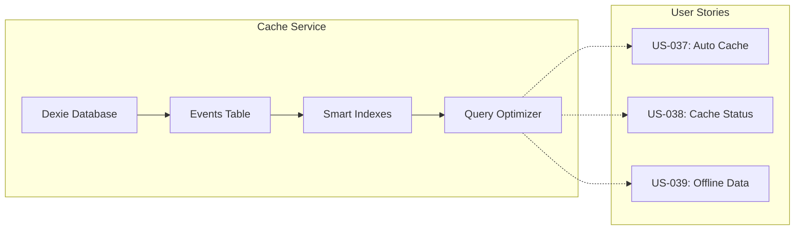
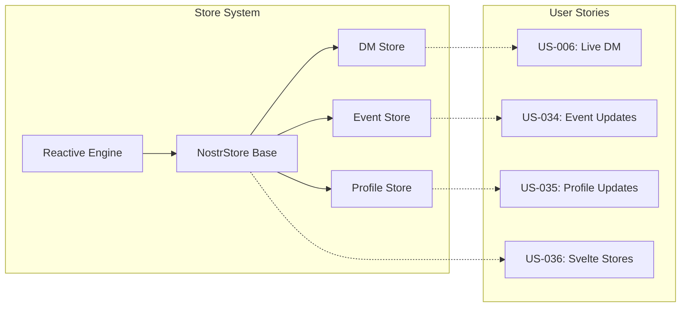
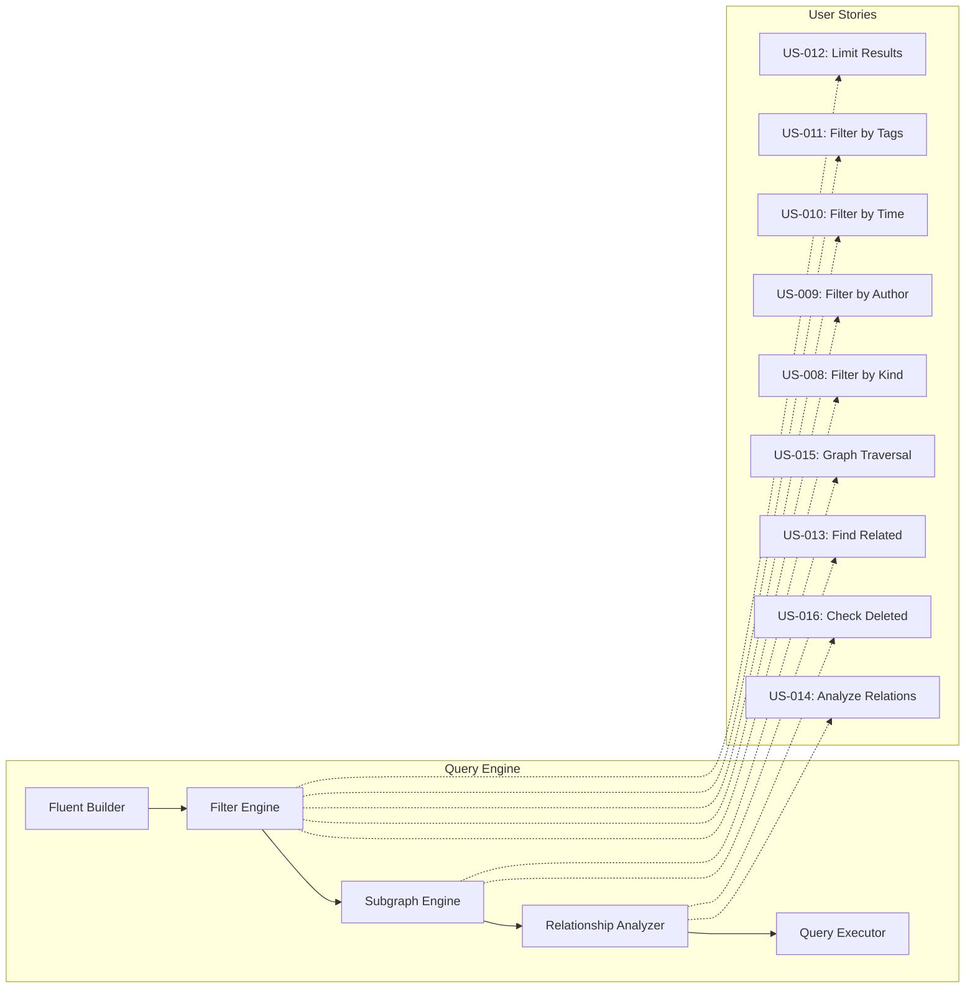
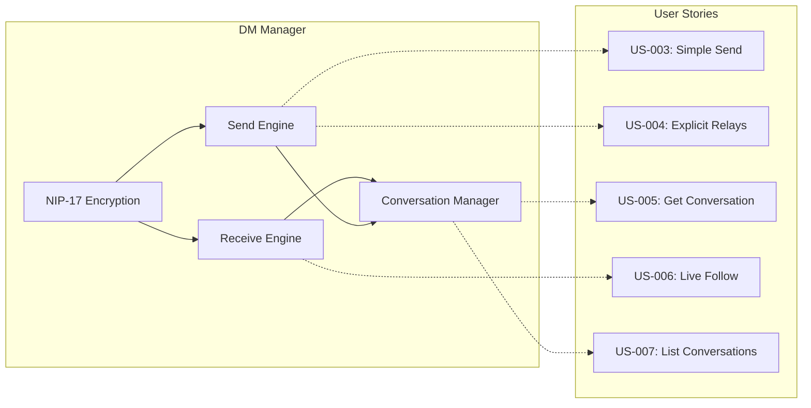
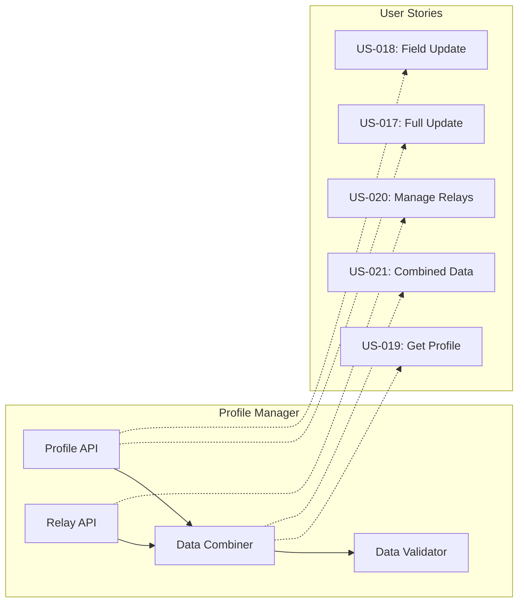
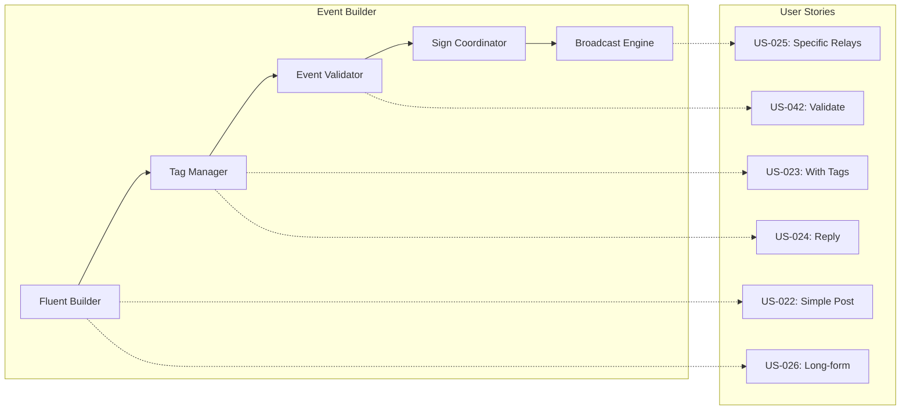
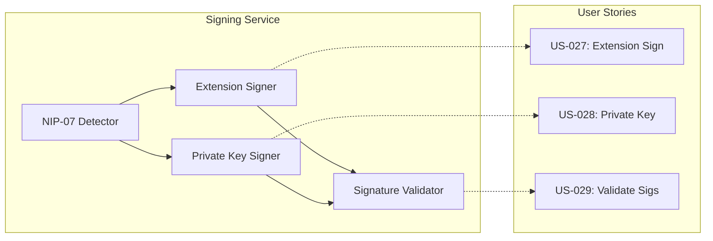
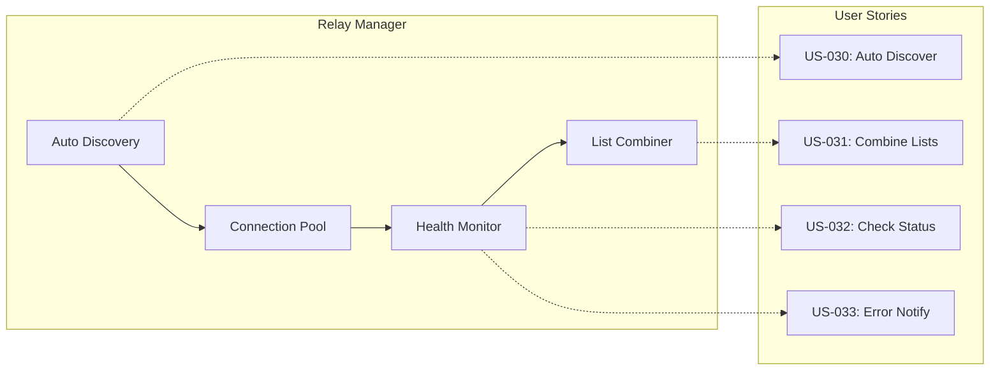
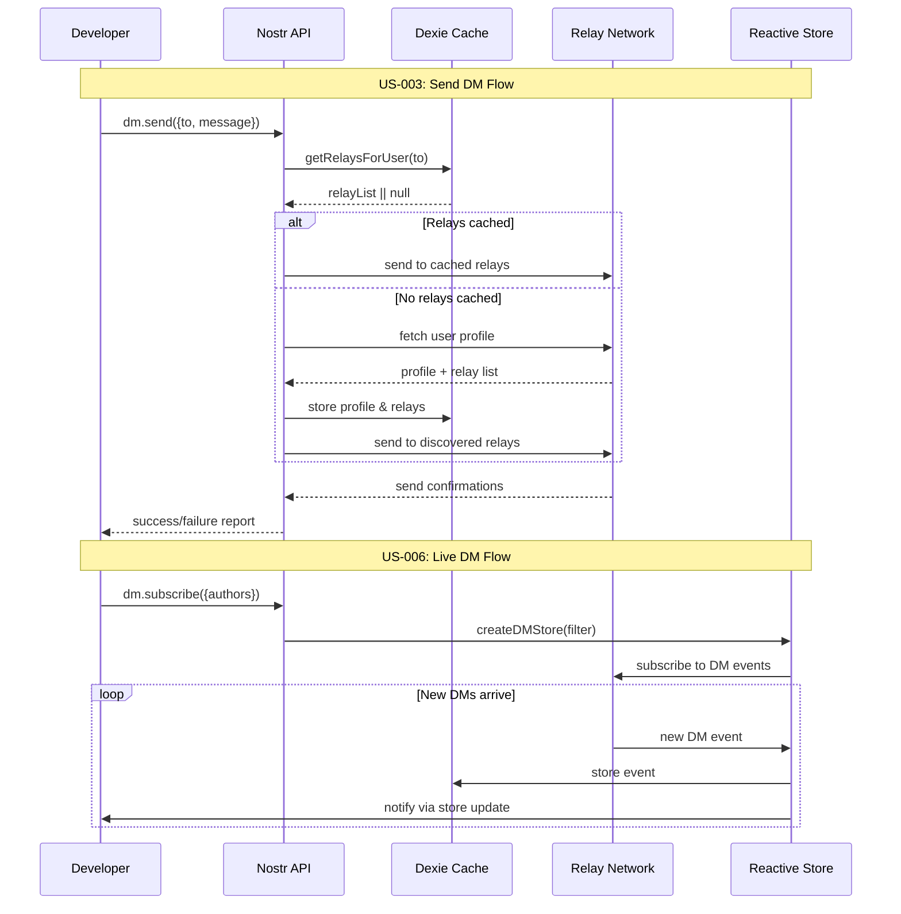

# Nostr Unchained - Library Architecture

## 🏗️ Übersicht

Diese Architektur zeigt die **komplette technische Struktur** von Nostr Unchained mit **exaktem Tech Stack** und **direkter Zuordnung zu User Stories**.

---

## 📊 **High-Level Architecture**

```mermaid
graph TB
    subgraph "🎯 Developer API Layer"
        API[Nostr Unchained API]
        DM[DM Manager]
        QUERY[Query Engine]
        PROFILE[Profile Manager]
        EVENTS[Event Builder]
        RELAYS[Relay Manager]
    end
    
    subgraph "⚡ Core Services Layer"
        CACHE[Cache Service<br/>Dexie.js]
        STORE[Store System<br/>Custom Reactive]
        SIGN[Signing Service<br/>NIP-07 + Crypto]
        CONN[Connection Pool<br/>WebSocket]
    end
    
    subgraph "🔧 Infrastructure Layer"
        CRYPTO[@noble/secp256k1<br/>@noble/hashes]
        WS[ws Library<br/>WebSocket Client]
        IDB[IndexedDB<br/>via Dexie.js]
        EXT[Browser Extensions<br/>NIP-07]
    end
    
    API --> DM
    API --> QUERY
    API --> PROFILE
    API --> EVENTS
    API --> RELAYS
    
    DM --> CACHE
    DM --> STORE
    DM --> SIGN
    
    QUERY --> CACHE
    QUERY --> STORE
    
    PROFILE --> CACHE
    PROFILE --> SIGN
    
    EVENTS --> SIGN
    EVENTS --> CONN
    
    RELAYS --> CONN
    RELAYS --> CACHE
    
    CACHE --> IDB
    SIGN --> CRYPTO
    SIGN --> EXT
    CONN --> WS
```

---

## 🎯 **Tech Stack Details**

### **Core Dependencies**
```typescript
{
  "dependencies": {
    "dexie": "^3.2.4",           // IndexedDB wrapper (~50KB)
    "@noble/secp256k1": "^2.0.0", // Crypto operations (~25KB)
    "@noble/hashes": "^1.3.0",    // SHA256 etc. (~15KB)
    "ws": "^8.14.0"               // WebSocket client (~10KB)
  },
  "peerDependencies": {
    // Keine - vollständig standalone
  }
}
```

### **Bundle Size Breakdown**
- **Dexie.js**: ~50KB (Cache & IndexedDB)
- **@noble/crypto**: ~40KB (Signierung & Hashing)
- **ws**: ~10KB (WebSocket connections)
- **Core Logic**: ~20KB (Query Engine, Stores, etc.)
- **Total**: ~120KB raw, **~80KB gzipped**

---

## 🔄 **Component Architecture**

### **1. Cache Service (Dexie.js)**



**Implementation:**
```typescript
// Dexie Schema
class NostrCache extends Dexie {
  events!: Dexie.Table<NostrEvent, string>;
  
  constructor() {
    super('NostrUnchained');
    this.version(1).stores({
      events: 'id, pubkey, created_at, kind, *tags'
    });
  }
}

// Supports US-037, US-038, US-039
```

### **2. Store System (Custom Reactive)**



**Implementation:**
```typescript
// Svelte-compatible Store
interface NostrStore<T> {
  subscribe: (callback: (value: T) => void) => () => void;
  update: (updater: (value: T) => T) => void;
  set: (value: T) => void;
}

// Supports US-006, US-034, US-035, US-036
```

### **3. Query Engine (Subgraph-based)**



**Implementation:**
```typescript
// Fluent Query API
const results = await nostr.query()
  .kinds([1, 6, 7])           // US-008
  .authors([pubkey1, pubkey2]) // US-009
  .since(timestamp)           // US-010
  .tags('#t', ['nostr'])      // US-011
  .limit(100)                 // US-012
  .subgraph(eventId)          // US-013, US-015
  .relationship(eventId)      // US-014, US-016
  .execute();
```

### **4. DM Manager (NIP-17)**



**Implementation:**
```typescript
// DM API
await nostr.dm.send({
  to: pubkey,                 // US-003
  message: "Hello!",
  relays: ['wss://...']       // US-004
});

const conv = await nostr.dm.getConversation(pubkey); // US-005
const dmStore = nostr.dm.subscribe();               // US-006 (alle DMs an mich)
const conversations = await nostr.dm.getConversations(); // US-007

// DM Flow: Verschlüsselt empfangen → Entschlüsseln → Cache speichern
```

### **5. Profile Manager (NIP-01 + NIP-65)**



**Implementation:**
```typescript
// Profile Management
await nostr.profile.update({...});        // US-017
await nostr.profile.set('name', 'Alice'); // US-018
const profile = await nostr.profile.get(pubkey); // US-019
await nostr.relays.updateMine([...]);     // US-020 (nur eigene!)
// profile.relays automatically combined   // US-021 (read-only für andere)
```

### **6. Event Builder (Fluent API)**



**Implementation:**
```typescript
// Event Building
await nostr.events.create()
  .kind(1)                    // US-022 (standard text note)
  .content("Hello!")
  .tag('t', 'nostr')          // US-023
  .replyTo(eventId)           // US-024
  .relays(['wss://...'])      // US-025
  .validate()                 // US-042 (reject if invalid)
  .sign()
  .broadcast();

// Spezielle Event-Arten (US-026)
await nostr.events.create()
  .kind(30023)                // Custom kind
  .content("Special content")
  .sign()
  .broadcast();
```

### **7. Signing Service (NIP-07 + Crypto)**



**Implementation:**
```typescript
// Signing Options
await event.sign();                    // US-027 (NIP-07 default)
await event.signWith(privateKey);     // US-028 (explicit)

// US-029: Validation happens automatically
// Invalid events are discarded, never reach cache
// No manual validation needed - transparent background process
```

### **8. Relay Manager (Connection Pool)**



**Implementation:**
```typescript
// Relay Management
const relays = await nostr.relays.getForUser(pubkey); // US-030
const combined = nostr.relays.union(list1, list2);    // US-031
const status = await nostr.relays.checkStatus();      // US-032
nostr.relays.onFailure((relay, error) => {...});      // US-033
```

---

## 🔄 **Data Flow Architecture**



---

## 🎯 **User Story Mapping**

### **Initialisierung & Setup**
- **US-001, US-002**: Handled by main API constructor and config system

### **Direct Messages (US-003 to US-007)**
- **Component**: DM Manager + NIP-17 Encryption
- **Dependencies**: Cache (relay discovery), Store (live updates), Signing Service

### **Event Queries Simple (US-008 to US-012)**
- **Component**: Query Engine (Filter Engine)
- **Dependencies**: Cache (Dexie indexes), Fluent Builder

### **Event Queries Complex (US-013 to US-016)**
- **Component**: Query Engine (Subgraph + Relationship Engine)
- **Dependencies**: Cache (relationship mapping), Graph algorithms

### **Profile Management (US-017 to US-021)**
- **Component**: Profile Manager + Data Combiner
- **Dependencies**: Cache (profile storage), Event Builder (updates)

### **Event Creation (US-022 to US-026)**
- **Component**: Event Builder + Fluent API
- **Dependencies**: Signing Service, Relay Manager (broadcast)

### **Signing & Security (US-027 to US-029)**
- **Component**: Signing Service + NIP-07 Integration
- **Dependencies**: @noble/crypto, Browser Extensions

### **Relay Management (US-030 to US-033)**
- **Component**: Relay Manager + Connection Pool
- **Dependencies**: WebSocket (ws), Health Monitor

### **Reactive Updates (US-034 to US-036)**
- **Component**: Store System + Reactive Engine
- **Dependencies**: Cache (data source), Custom event system

### **Caching & Performance (US-037 to US-039)**
- **Component**: Cache Service (Dexie.js)
- **Dependencies**: IndexedDB, Smart indexing

### **Debugging & Development (US-040 to US-042)**
- **Component**: Error System + Validator
- **Dependencies**: Event Builder (validation), Debug logger

---

## 📦 **Module Structure**

```
src/
├── core/
│   ├── NostrUnchained.ts      # Main API (US-001, US-002)
│   ├── Cache.ts               # Dexie wrapper (US-037, US-038, US-039)
│   └── Store.ts               # Reactive stores (US-034, US-035, US-036)
├── dm/
│   ├── DMManager.ts           # DM operations (US-003, US-004, US-005)
│   ├── Encryption.ts          # NIP-17 crypto (US-003, US-004)
│   └── Conversations.ts       # Chat management (US-006, US-007)
├── query/
│   ├── QueryBuilder.ts        # Fluent API (US-008 to US-012)
│   ├── SubgraphEngine.ts      # Complex queries (US-013, US-015)
│   └── RelationshipAnalyzer.ts # Event relations (US-014, US-016)
├── profile/
│   ├── ProfileManager.ts      # Profile ops (US-017, US-018, US-019)
│   ├── RelayManager.ts        # Relay lists (US-020, US-030, US-031)
│   └── DataCombiner.ts        # Merge profile+relays (US-021)
├── events/
│   ├── EventBuilder.ts        # Fluent builder (US-022 to US-026)
│   ├── Validator.ts           # Event validation (US-042)
│   └── Broadcaster.ts         # Multi-relay send (US-025)
├── signing/
│   ├── SigningService.ts      # Sign coordination (US-027, US-028)
│   ├── NIP07Detector.ts       # Extension detection (US-027)
│   └── SignatureValidator.ts  # Verify sigs (US-029)
├── relays/
│   ├── ConnectionPool.ts      # WebSocket pool (US-032, US-033)
│   ├── HealthMonitor.ts       # Relay status (US-032, US-033)
│   └── AutoDiscovery.ts       # NIP-65 discovery (US-030)
└── utils/
    ├── ErrorHandler.ts        # Error system (US-040)
    ├── Logger.ts              # Debug logging (US-041)
    └── Types.ts               # TypeScript definitions
```

---

## 🎯 **Performance Targets**

| Component | Target | User Stories |
|-----------|--------|--------------|
| Cache Queries | <50ms | US-008 to US-016, US-037 |
| DM Send | <2s | US-003, US-004 |
| Profile Load | <1s | US-019, US-021 |
| Event Build | <10ms | US-022 to US-026 |
| Store Updates | <5ms | US-034 to US-036 |
| Relay Discovery | <3s | US-030 |

---

## 🚀 **Implementation Priority**

### **Phase 1: Foundation (Weeks 1-4)**
1. Cache Service (Dexie.js) → US-037, US-038, US-039
2. Store System → US-034, US-035, US-036
3. Basic Query Engine → US-008 to US-012
4. Signing Service → US-027, US-028, US-029

### **Phase 2: Core Features (Weeks 5-8)**
1. DM Manager → US-003 to US-007
2. Profile Manager → US-017 to US-021
3. Event Builder → US-022 to US-026
4. Relay Manager → US-030 to US-033

### **Phase 3: Advanced (Weeks 9-12)**
1. Complex Query Engine → US-013 to US-016
2. Error & Debug System → US-040 to US-042
3. Performance Optimization
4. Documentation & Examples

Diese Architektur stellt sicher, dass **jede User Story** einem **konkreten Component** zugeordnet ist und der **Tech Stack** exakt definiert ist. 