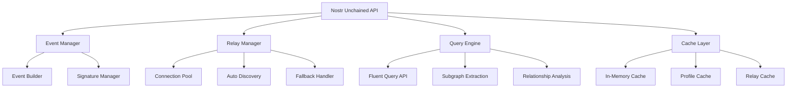

# Nostr Unchained - Technical Specifications

## Executive Summary

Nostr Unchained is a next-generation JavaScript Nostr client library designed with **massive focus on Developer Experience (DX)**. Born from the lessons learned in Bitspark development, it addresses critical pain points in Nostr development: elegant event handling, intelligent relay management, complex querying, and intuitive subscription management.

## 🎯 Core Design Principles

1. **DX-First**: Every API decision prioritizes developer joy and productivity
2. **High-Level Abstractions**: Complex Nostr concepts become simple method calls
3. **Intelligent Automation**: Auto-discovery, caching, and relay management work seamlessly
4. **Universal Compatibility**: Browser and Node.js support with minimal configuration
5. **Performance by Design**: Built-in caching, connection pooling, and optimization

## 🏗️ Architecture Overview



## 🚀 Core API Design

### Initialization & Configuration

```typescript
import { NostrUnchained } from 'nostr-unchained';

const nostr = new NostrUnchained({
  privateKey: userPrivateKey, // optional, for signing
  relays: [                   // user's default relays
    'wss://relay.example.com',
    'wss://nos.lol'
  ],
  cache: {
    maxEvents: 10000,
    ttl: 24 * 60 * 60 * 1000  // 24h in milliseconds
  },
  debug: true // enhanced developer feedback
});
```

### 📩 Direct Messages API

```typescript
// Simple DM sending
await nostr.dm.send({
  to: recipientPubkey,
  message: "Hello, Nostr!",
  // relays auto-discovered from recipient's profile
});

// Advanced DM with explicit relay control
await nostr.dm.send({
  to: recipientPubkey,
  message: "Hello!",
  relays: ['wss://custom.relay.com'], // override auto-discovery
  fallbackToUserRelays: true
});

// DM subscription with reactive patterns
const unsubscribe = nostr.dm.subscribe((message) => {
  console.log(`New DM from ${message.author.name}: ${message.content}`);
  console.log(`Received via relays: ${message.receivedFrom}`);
});

// Get DM conversation history
const conversation = await nostr.dm.getConversation(otherPubkey, {
  limit: 50,
  cached: true
});
```

### 🔍 Advanced Query Engine

```typescript
// Simple queries
const posts = await nostr.query()
  .kind(1)                    // text notes
  .author(['pubkey1', 'pubkey2'])
  .since('2024-01-01')
  .limit(50)
  .cached(true)
  .execute();

// Complex subgraph extraction
const jobEvents = await nostr.query()
  .subgraph(jobId)            // get all events related to this job
  .include(['replies', 'reactions', 'zaps'])
  .traversal('breadth-first')
  .execute();

// Relationship queries
const hasDecline = await nostr.query()
  .relationship(eventId)
  .hasChild('kind:5')         // decline events
  .where('tags.contains', ['reason', 'spam'])
  .exists();

// State queries for complex conditions
const eventState = await nostr.query()
  .event(eventId)
  .analyze({
    isDeclined: 'children.kind:5.exists',
    totalReactions: 'children.kind:7.count',
    hasValidSignature: 'signature.valid'
  });
```

### 🌐 Intelligent Relay Management

```typescript
// Get user's relays
const userRelays = await nostr.relays.getForUser(pubkey);

// Get your own relays
const myRelays = nostr.relays.mine;

// Union operations for advanced relay control
const targetRelays = nostr.relays
  .union(myRelays, userRelays)
  .filter(relay => relay.isReachable)
  .prioritize(['wss://priority.relay.com']);

// Send with explicit relay control
await nostr.events.create()
  .kind(1)
  .content("Hello world!")
  .relays(targetRelays)
  .sign()
  .send();

// Relay health monitoring
nostr.relays.onFailure((relay, error) => {
  console.log(`Relay ${relay.url} failed: ${error.message}`);
});
```

### 👤 Profile Management

```typescript
// Complete profile update
await nostr.profile.update({
  name: "Alice",
  about: "Nostr developer",
  picture: "https://example.com/alice.jpg",
  relays: ['wss://alice.relay.com']
});

// Single field update (internally creates full profile event)
await nostr.profile.set('name', 'Alice Updated');

// Profile with validation
const profile = await nostr.profile.create({
  name: "Alice",
  // client-side validation before send
  validate: true
});

// Get profile (with auto-caching)
const aliceProfile = await nostr.profile.get(alicePubkey);
console.log(aliceProfile.relays); // auto-cached relay list
```

### 🔄 Event Building & Sending

```typescript
// Fluent event building
await nostr.events.create()
  .kind(1)
  .content("This is a test post")
  .tag('t', 'nostr')
  .tag('t', 'decentralized')
  .replyTo(originalEventId)
  .sign()
  .send();

// Complex event with validation
const jobEvent = await nostr.events.create()
  .kind(30023) // long-form content
  .content("Job description...")
  .tag('d', jobId)
  .tag('title', 'Senior Developer Position')
  .tag('category', 'jobs')
  .validate() // client-side validation
  .sign()
  .broadcast(['wss://jobs.relay.com', 'wss://main.relay.com']);
```

## 📊 Caching Strategy

### Recommendation: Hybrid Approach

```typescript
interface CacheConfig {
  // In-memory for hot data
  memory: {
    maxEvents: 10000,
    maxProfiles: 1000,
    ttl: 30 * 60 * 1000 // 30 minutes
  },
  
  // IndexedDB for persistence (optional)
  persistent: {
    enabled: false, // disabled by default for decentralization
    maxSize: '50MB',
    encryption: true
  }
}
```

**Rationale**: Start with pure in-memory caching for maximum decentralization. Provide opt-in IndexedDB persistence for power users who want better performance across sessions.

### Cache Invalidation Strategy

```typescript
// Event-based invalidation
nostr.cache.on('profileUpdate', (pubkey) => {
  nostr.cache.invalidate(`profile:${pubkey}`);
  nostr.cache.invalidate(`relays:${pubkey}`);
});

// Smart preloading
nostr.cache.preload({
  profiles: followingList,
  events: ['job-related', 'recent-dms']
});
```

## 🔄 Reactive System Recommendation

### Custom Event System (Not RxJS)

**Rationale**: 
- **Bundle Size**: RxJS adds ~30KB, we target <50KB total
- **Learning Curve**: Custom events are more familiar to average JS developers
- **Specific Needs**: Nostr-specific patterns don't need full RxJS power

```typescript
// Custom reactive system
class NostrEventEmitter {
  subscribe(pattern: string, callback: Function): Unsubscribe {
    // Implementation optimized for Nostr patterns
  }
  
  once(pattern: string, callback: Function): void {
    // One-time subscriptions
  }
}

// Usage
const unsubscribe = nostr.on('dm:received', (message) => {
  // Handle new DM
});

nostr.on('event:*', (event) => {
  // Handle any event type
});

nostr.once('connected', () => {
  // Handle initial connection
});
```

## 🌐 Connection Management

### Efficient WebSocket Pooling

```typescript
interface ConnectionPool {
  // Merge similar subscriptions
  mergeSubscriptions: boolean;
  
  // Connection limits per relay
  maxConnectionsPerRelay: 1;
  
  // Automatic reconnection
  reconnect: {
    enabled: true,
    maxAttempts: 5,
    backoff: 'exponential'
  };
  
  // Subscription fusion
  fusionRules: {
    profiles: true,    // Merge all profile requests
    events: true,      // Merge compatible event filters
    dms: false         // Keep DM subscriptions separate for privacy
  };
}
```

## 🔒 Security & Validation

### Strict Security by Design

```typescript
// All events auto-validated
interface SecurityConfig {
  validateSignatures: true,  // Cannot be disabled
  validateEventStructure: true,
  validateNIP04Encryption: true,
  validateNIP17Encryption: true,
  
  // Developer warnings for common mistakes
  devWarnings: {
    unsignedEvents: true,
    publicKeyExposure: true,
    weakRelaySelection: true
  }
}
```

## 🎯 User Stories & Acceptance Criteria

### Epic 1: Effortless DM Experience

**Story 1.1**: *As a developer, I want to send a DM with minimal code*
- **Given** I have a recipient's pubkey
- **When** I call `nostr.dm.send({to: pubkey, message: "hello"})`
- **Then** The library auto-discovers recipient relays and sends the DM
- **And** I receive confirmation of successful delivery

**Story 1.2**: *As a developer, I want clear feedback on relay failures*
- **Given** Some recipient relays are offline
- **When** I send a DM
- **Then** I receive a detailed report showing which relays succeeded/failed
- **And** The DM is still delivered to available relays

### Epic 2: Powerful Query Engine

**Story 2.1**: *As a developer, I want to extract all events related to a job*
- **Given** A job event ID
- **When** I call `nostr.query().subgraph(jobId).execute()`
- **Then** I receive all directly and indirectly related events
- **And** The traversal is efficient and configurable

**Story 2.2**: *As a developer, I want to check if an event was declined*
- **Given** An event ID
- **When** I call `nostr.query().relationship(eventId).hasChild('kind:5').exists()`
- **Then** I get a boolean indicating if a decline event exists
- **And** I can access the decline reason if present

### Epic 3: Intelligent Relay Management

**Story 3.1**: *As a developer, I want automatic relay discovery*
- **Given** A user's pubkey enters my cache
- **When** The profile is fetched
- **Then** Their relays are automatically cached and available
- **And** Future operations use their preferred relays

## 📈 Performance Targets

### Core Metrics

| Metric | Target | Measurement |
|--------|--------|-------------|
| Bundle Size (Core) | <50KB gzipped | Webpack Bundle Analyzer |
| Time to First DM | <5 seconds | From init to sent |
| Query Response Time | <200ms | Cached queries |
| Memory Usage | <50MB | For 10k cached events |
| Connection Setup | <2 seconds | Multi-relay connection |

### Performance Monitoring

```typescript
// Built-in performance tracking
nostr.performance.on('slow-query', (query, duration) => {
  console.warn(`Slow query detected: ${duration}ms`, query);
});

nostr.performance.getStats(); // Runtime performance data
```

## 🛠️ Developer Experience Features

### Enhanced Error Handling

```typescript
try {
  await nostr.dm.send({to: pubkey, message: "test"});
} catch (error) {
  if (error instanceof NostrUnchainedError) {
    console.log(error.code);        // 'RELAY_UNREACHABLE'
    console.log(error.message);     // Human-readable
    console.log(error.details);     // Technical details
    console.log(error.suggestions); // How to fix
  }
}
```

### Development Tools

```typescript
// Debug mode with rich logging
const nostr = new NostrUnchained({
  debug: true,
  debugLevel: 'verbose' // 'basic' | 'verbose' | 'trace'
});

// Event inspector
nostr.debug.inspectEvent(eventId); // Detailed event analysis
nostr.debug.networkStatus();       // Relay connection states
nostr.debug.cacheStats();         // Cache hit rates and size
```

### TypeScript Excellence

```typescript
// Full TypeScript support with strict types
interface NostrEvent<K extends number = number> {
  kind: K;
  content: string;
  // ... strict typing for all Nostr concepts
}

// Generic query builder with type safety
const textNotes = await nostr.query<TextNote>()
  .kind(1)
  .execute(); // Returns TextNote[] with proper typing
```

## 🚀 Implementation Roadmap

### Phase 1: Core Foundation (Weeks 1-4)
- [ ] Basic event creation and signing
- [ ] Simple relay connection management
- [ ] In-memory caching system
- [ ] Basic DM send/receive functionality

### Phase 2: Advanced Features (Weeks 5-8)
- [ ] Fluent query API implementation
- [ ] Subgraph extraction algorithms
- [ ] Profile management with auto-discovery
- [ ] Connection pooling and optimization

### Phase 3: Developer Experience (Weeks 9-12)
- [ ] TypeScript definitions and strict typing
- [ ] Enhanced error handling and debugging
- [ ] Performance monitoring and optimization
- [ ] Comprehensive documentation and examples

### Phase 4: Advanced Querying (Weeks 13-16)
- [ ] Complex relationship analysis
- [ ] Custom traversal algorithms
- [ ] Advanced caching strategies
- [ ] Plugin architecture for extensibility

## 🔧 Technical Decisions Summary

| Decision | Choice | Rationale |
|----------|--------|-----------|
| **Reactive System** | Custom Events | Bundle size, familiarity, Nostr-specific optimization |
| **Caching** | In-memory primary, IndexedDB optional | Decentralization, performance, user choice |
| **Bundle Size** | <50KB core, modular plugins | Fast loading, tree-shaking friendly |
| **TypeScript** | Full support with strict types | Developer experience, error prevention |
| **Connection Strategy** | Pooled with subscription fusion | Efficiency, reduced resource usage |
| **Error Handling** | Structured errors with suggestions | Developer productivity, debugging ease |
| **Validation** | Strict security, always-on | Security by design, trust but verify |

## 📝 Next Steps

1. **Validate API Design**: Review the proposed API with target developers
2. **Create Proof of Concept**: Build core DM functionality to validate approach  
3. **Performance Benchmarking**: Test query performance with realistic data sets
4. **Community Feedback**: Share specifications with Nostr development community
5. **Begin Implementation**: Start with Phase 1 core foundation

---

*This specification represents the technical foundation for making Nostr development truly joyful. Every decision prioritizes developer experience while maintaining the decentralized principles that make Nostr powerful.* 